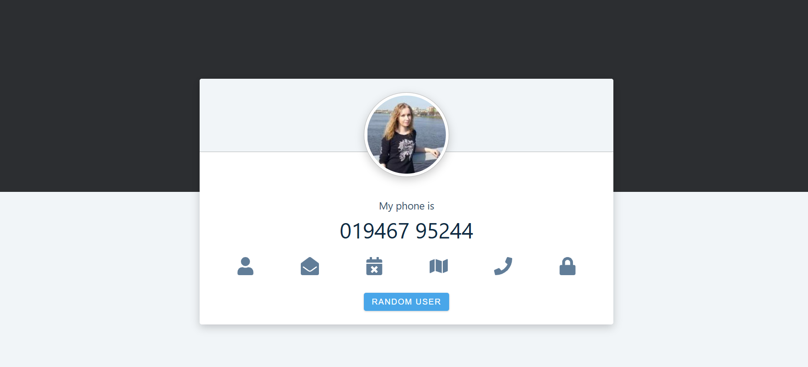

# random person

# Random Person Info Fetcher
This project fetches a random person's data from a given URL using the Fetch API, parses the response into JSON format, extracts the necessary information (image, phone, name, and email), and renders it to the page. If the data lacks an image, a default image will be used instead.
using fetch function fetch the given url

# Features:
Fetches random person data

Extracts and displays image, phone, name, and email

Uses a default image if no image is provided

## page look like

